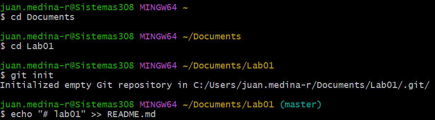
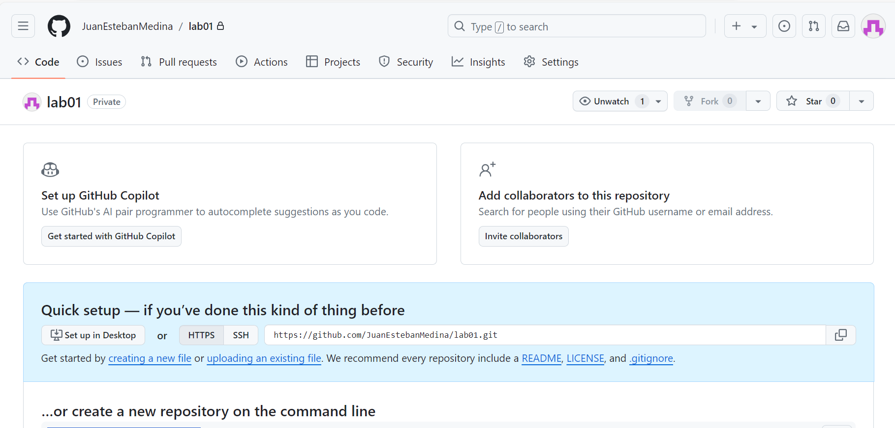
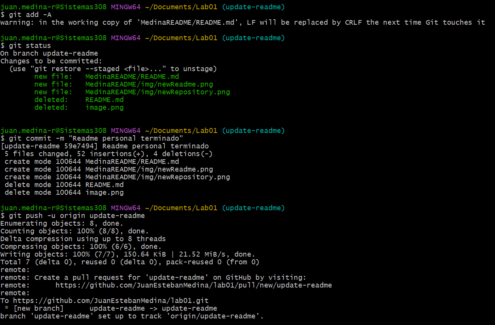

# lab01 (Parte 1. Individual)
Juan Esteban Medina Rivas

1. Crea un repositorio localmente.

Abrir git Bash, dirigirse al directorio donde quiera crearse el repositorio local y utilizar
*git init* para inicializarlo.

2. Agrega un archivo de ejemplo al repositorio, el README.md puede ser una gran opción.

Con ayuda de git se encontró que el siguiente comando sirve para crear desde consola el archivo
*echo "# lab01" >> README.md*

3. Averigua para qué sirve y como se usan estos comandos git add y git commit -m “mensaje”

*git add*

El comando git add agrega archivos nuevos o modificados en su directorio de trabajo al área de preparación de Git.
Tiene reputación de ser un comando innecesario pero ayuda a tener una mejor organización de trabajo. Además de dejar seleccionar que archivos concretos son los que queremos mandar al área de preparación.

Se puede utilizar de 3 formas
- `git add <Path>` Añadir un directorio o archivo específico al área de preparación.
- `git add -A` Añadir todos los archivos (que no estén listados en el `.gitignore`) en todo el repositorio al área de preparación.
- `git add -p` Añadir interactivamente fragmentos de cambios al área de preparación.

*git commit*

Crea lo que se conoce como una captura del repositorio en un momento específico. Se recomienda hacer commits periodicamente para crear un historial de los cambios realizados en el repositorio.

`git commit -m "mensaje"`

5. Crea un repositorio en blanco (vacío) e GitHub.

6. Configura el repositorio local con el repositorio remoto.

`git remote add origin https://github.com/NOMBRE_USUARIO/NOMBRE_PROYECTO.git`

`juan.medina-r@Sistemas308 MINGW64 ~/Documents/Lab01 (master)` \
`$ git remote add origin https://github.com/JuanEstebanMedina/lab01.git`

7. Sube los cambios, teniendo en cuenta lo que averiguaste en el punto 3 Utiliza los siguientes comando en el directorio donde tienes tu proyecto, en este orden:

  `git add .` \
  `git commit -m "mensaje, lo que hiciste con el archivo"` \
  `git push "url repositorio"`

9. Vuelve a subir los cambios y observa que todo esté bien en el repositorio remoto (en GitHub).

