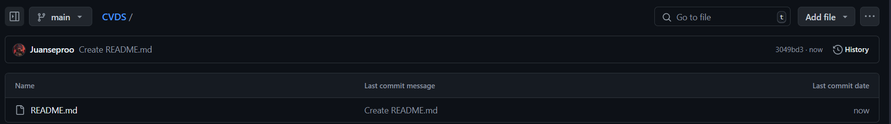
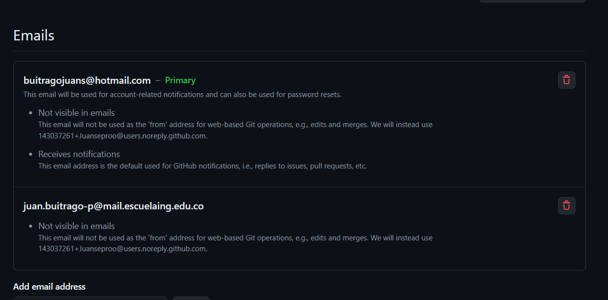
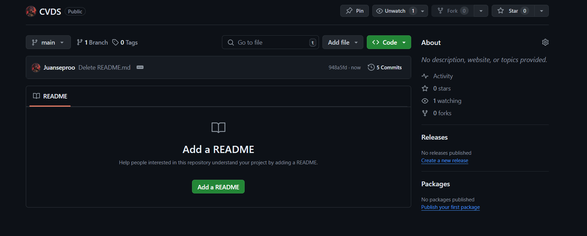
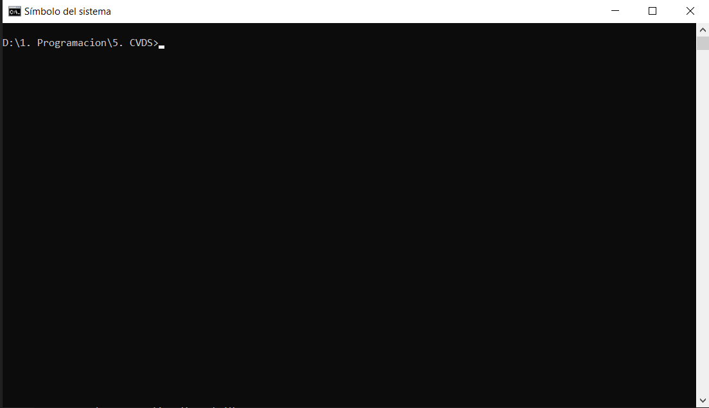
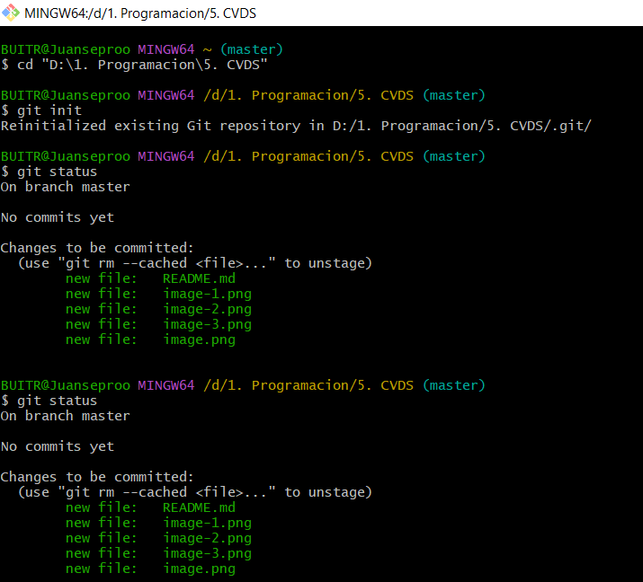
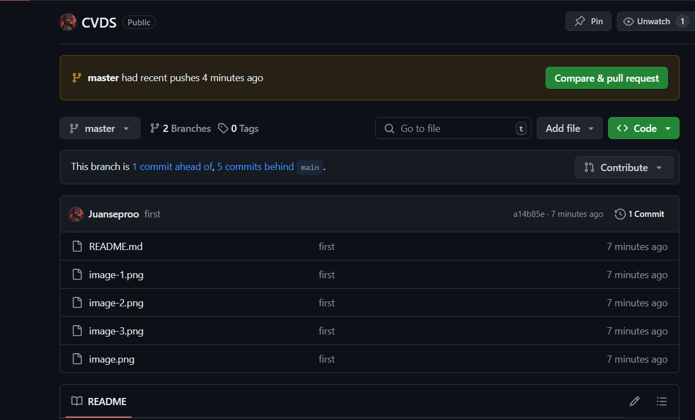

# CVDS - Juan Sebastian Buitrago Piñeros 
# PARTE I (Trabajo Individual).

1. Crea un repositorio localmente.

2. Agrega un archivo de ejemplo al repositorio, el README.md puede ser una gran opción.

3. Averigua para qué sirve y como se usan estos comandos git add y git commit -m “mensaje”

* git add: Añade archivos o cambios al área de preparación de Git. Marca los archivos que deseas incluir en el próximo commit.

Uso: 
git add <archivo>: Añade un archivo específico al área de preparación.
git add .: Añade todos los archivos modificados en el directorio actual y sus subdirectorios al área de preparación.
git add <directorio>: Añade todos los archivos modificados en un directorio específico al área de preparación.

(https://git-scm.com/docs/git-add)

* git commit -m "mensaje": Se utiliza para crear un commit (registro de los cambios realizado en un proyecto) y que han sido añadidos al área de preparación mediante un git add.
Ademas de esto, el commit incluye un mensaje descriptivo que tú proporcionas para explicar qué cambios se realizaron en ese commit.

Uso:
git commit: Abrirá el editor de texto configurado localmente y solicitará que se introduzca un mensaje de confirmación
git commit -a: Confirma una instantánea de todos los cambios del directorio de trabajo. Esta acción solo incluye las modificaciones a los archivos con seguimiento (los que se han añadido con git add en algún punto de su historial)
git commit -m <commit message>: La opción -m permite añadir un mensaje de commit directamente en la línea de comandos sin necesidad de abrir un editor de texto. Este mensaje describe los cambios realizados.

(https://www.atlassian.com/es/git/tutorials/saving-changes/git-commit)

4. Abre una cuenta de github, si ya la tienes, enlazala con el correo institucional.

5. Crea un repositorio en blanco (vacío) e GitHub.

6. Configura el repositorio local con el repositorio remoto.

Ubico la carpeta

Y se colocan estos comandos:

git init

git add .a

git commit -m "first commit"

git remote add origin https://github.com/Juanseproo/CVDS.git

git push -u origin master

8. Configura el correo en git local de manera correcta

9. Vuelve a subir los cambios y observa que todo esté bien en el repositorio remoto (en GitHub).
