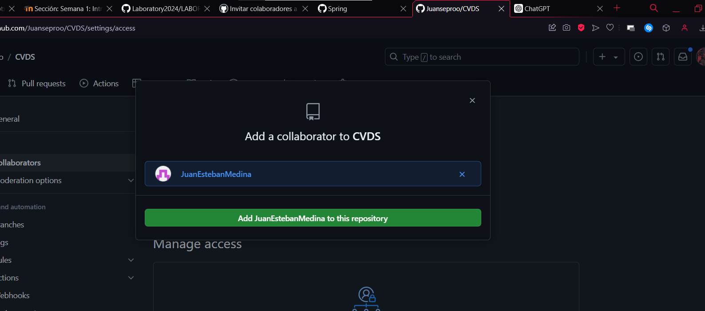

# CVDS - Juan Sebastian Buitrago Piñeros - Juan Esteban Medina 
# PARTE II (Trabajo en parejas)

1. Se escogen los roles para trabajar en equipo, una persona debe escoger ser "Owner" o Propietario del repositorio y la otra "Collaborator" o Colaborador en el repositorio.

Juan Sebastian Buitrago Piñeros -> Owner
Juan Esteban Medina  -> Collaborator

2. El owner agrega al colaborador con permisos de escritura en el repositorio que creó en la parte 1.

3. El owner le comparte la url via Teams al colaborador

4. El colaborador acepta la invitación al repositorio
aaa

5. Owner y Colaborador editan el archivo README.md al mismo tiempo e intentan subir los cambios al mismo tiempo.

6. ¿Que sucedió?

7. La persona que perdió la competencia de subir los cambios, tiene que resolver los conflictos, cúando haces pull de los cambios, los archivos tienen los símbolos <<< === y >>> (son normales en la resolución de conflictos), estos conflictos debes resolverlos manualmente. Como resolver Conflictos GitHub

8. Resuelvan el conflicto con IntelliJ si es posible, Resolver conflictos en IntelliJ

De esta forma ya sabes resolver conflictos directamente sobre los archivos y usando un IDE como IntelliJ, esto te será muy útil en los futuros trabajos en equipo con Git.
.
