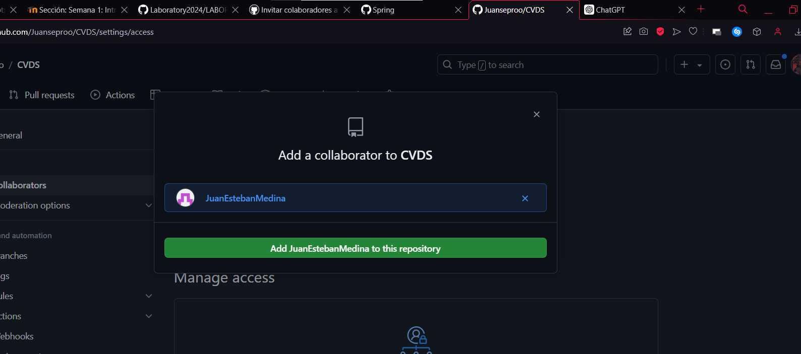

# CVDS 

# Integrantes
Juan Sebastian Buitrago Piñeros \
Juan Esteban Medina Rivas

# Respuestas

## PARTE II (Trabajo en parejas)

1. Se escogen los roles para trabajar en equipo, una persona debe escoger ser "Owner" o Propietario del repositorio y la otra "Collaborator" o Colaborador en el repositorio.

Juan Sebastian Buitrago Piñeros -> Owner \
Juan Esteban Medina  -> Collaborator

2. El owner agrega al colaborador con permisos de escritura en el repositorio que creó en la parte 1.

3. El owner le comparte la url via Teams al colaborador

4. El colaborador acepta la invitación al repositorio
aaa

5. Owner y Colaborador editan el archivo README.md al mismo tiempo e intentan subir los cambios al mismo tiempo.

6. ¿Que sucedió?

7. La persona que perdió la competencia de subir los cambios, tiene que resolver los conflictos, cúando haces pull de los cambios, los archivos tienen los símbolos <<< === y >>> (son normales en la resolución de conflictos), estos conflictos debes resolverlos manualmente. Como resolver Conflictos GitHub

8. Resuelvan el conflicto con IntelliJ si es posible, Resolver conflictos en IntelliJ

De esta forma ya sabes resolver conflictos directamente sobre los archivos y usando un IDE como IntelliJ, esto te será muy útil en los futuros trabajos en equipo con Git.

## Parte III (Trabajo en parejas)

1. ¿Hay una mejor forma de trabajar con git para no tener conflictos?

Lo primero que consideramos es una buena comunicación entre el grupo de trabajo pues si cada persona o subgrupo tiene delimitada una u otra zona de trabajo, no habrá colisiones con las otras partes del grupo. \
Si se trabaja en un equipo, utilizar pull requests o merge requests para revisar el código antes de fusionarlo permite a otros miembros del equipo revisar y discutir los cambios, y puede ayudar a identificar problemas antes de que se integren.

2. ¿Qué es y como funciona el Pull Request?
Un pull request es una petición que el propietario de un fork de un repositorio hace al propietario del repositorio original para que este último incorpore los commits que están en el fork.

3. Creen una rama cada uno y suban sus cambios
Esto ya lo habiamos realizado cuando subimos el README con las respuestas personales de la parte 1 del laboratorio

